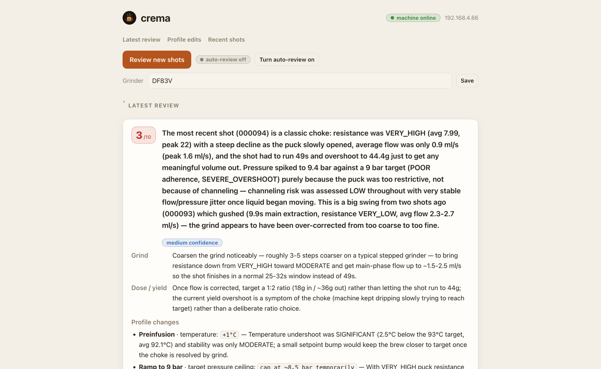

# crema ☕

**Automated GaggiMate shot-history reviewer.** crema pulls your recent espresso
shots off the machine, sends their telemetry to Claude, and gets back concrete
grind / dose / profile suggestions — in a small web report you can also trigger
on demand. It runs unattended on an always-on box (a Raspberry Pi is ideal) on
the same network as the machine.

Think of it as the hands-off counterpart to the interactive
[`gaggimate-mcp`](https://github.com/julianleopold/gaggimate-mcp) server: instead
of opening a chat to ask Claude about your shots, crema watches for new shots and
reviews them automatically, then shows the result in a web page with a one-click
path to draft and push a corrected profile.

## Screenshots

<!-- Drop a screenshot of the web report at docs/report.png and uncomment: -->
<!--  -->

_Add a screenshot of the web report here — see [`docs/SCREENSHOTS.md`](docs/SCREENSHOTS.md) for how to capture one._

## What you need

- A **GaggiMate**-controlled espresso machine, reachable on your home network
  (its API is LAN-only — see [How it works](#how-it-works)).
- A separate **always-on computer on the same network** to run crema — a
  Raspberry Pi (3 / 4 / 5, or Zero 2 W) is ideal, but any always-on Linux or
  macOS machine works. **This is _not_ the espresso machine's controller:** crema
  needs Python and a real operating system, so it can't run on the GaggiMate's
  ESP32 board or an Arduino — it runs on its own little computer alongside the
  machine.
- **Python 3.13+** on that computer.

### Minimum hardware & OS support

crema is deliberately light — a plain Python web app with SQLite, no JavaScript
frameworks, and the AI heavy lifting done by Anthropic's servers, not your box.

| | Minimum that works | Notes |
|---|---|---|
| **Device** | Raspberry Pi Zero 2 W / Pi 3 or newer | Runs happily on a 32-bit armv7 Pi (that's what it was built on); any x86/ARM mini PC, old laptop, or NAS that runs Linux is more than enough |
| **RAM** | ~512 MB total system RAM | crema itself uses on the order of 100 MB |
| **Disk** | ~300 MB | Python 3.13 + dependencies; the shot database itself is tiny (KBs per shot, pruned after 30 days by default) |
| **CPU / GPU** | Anything | It idles between reviews; no GPU, no local AI model |

| OS | Status |
|---|---|
| **Linux** (Raspberry Pi OS, Debian, Ubuntu, …) | ✅ Fully supported — the intended home; `deploy/setup.sh` + systemd give you the unattended setup |
| **macOS** | ✅ Works for running crema manually (`crema serve`, reviews, pushes); the systemd deploy script is Linux-only, so schedule with cron or a LaunchAgent instead |
| **Windows** | ⚠️ Untested. The Python app itself should run, but the setup script, systemd units, and parts of `crema doctor` assume a Unix system — use **WSL** (Windows Subsystem for Linux) and follow the Linux instructions |
- A **paid Anthropic API account** for Claude — this is what does the reviewing
  (see [The AI (Claude)](#the-ai-claude)). **This costs real money: you pay Anthropic
  directly, per shot reviewed.** It's cheap for home use (roughly a dollar or two
  a month), but it is a metered bill, not a free service — read [Cost](#cost)
  before you set this up.

You do **not** need the machine powered on to browse past reviews or draft a
profile edit — only to pull new shots or push an approved edit back.

## What it does

- **Ingest** — downloads new shots (binary `.slog`) from the device and parses
  them into AI-friendly JSON with physics diagnostics (channeling risk,
  puck resistance, temp stability, profile compliance).
- **Review** — hands the recent-shot window to Claude and stores a structured
  set of suggestions plus a 1–10 quality score.
- **Draft** — turns a review's profile suggestions into a complete, validated
  profile (rewritten from the one the shot ran on), clamped to device-safe
  bounds, stored as a *pending edit*. You can add your own notes (how it tasted,
  what you want) when drafting, and **refine** any draft with further notes
  before approving — Claude redrafts and the old version is superseded.
- **Approve & push** — on your say-so, writes the edit to the machine as a **new
  `[AI]` profile** over WebSocket (never overwrites your original; you select it
  on the machine). If a draft changes the shot's **stop conditions** (volume /
  flow / pressure targets that end the shot), crema lists exactly what changed
  and requires an explicit acknowledgement before it will push.
- **Report** — a small web page shows reviews, drafts, and recent shots, with
  “Run review”, “Draft profile edit”, and “Approve & push” buttons.

Grind and dose/yield are suggested as text (manual bench changes); only profile
changes get drafted and pushed.

> [!NOTE]
> **crema complements GaggiMate — it doesn't replace it.** You still brew from
> the machine and use GaggiMate's own display and web UI for live shot graphs,
> pressure/flow curves, and profile management. crema sits alongside, reading
> the same shot history and adding an AI review layer on top: scores,
> diagnoses, and suggested adjustments you approve back into the machine.

## How it works

The GaggiMate machine only exposes its API on your **home network** (list/
download shots over HTTP, read/write profiles over WebSocket). So a scheduled
reviewer needs an always-on box on that same network — the Pi that's already
running is exactly that. Everything runs there and reaches the machine directly;
no cloud, no tunnel-to-device.

```
        always-on box (e.g. a Pi) on your LAN
 ┌────────────┐   ┌─────────────────────────────────────────┐
 │  GaggiMate │   │  timer / "Run review" button            │
 │  machine   │◀──│    │                                    │
 │ HTTP + WS  │   │    ├─ pull new shots → parse .slog       │
 └────────────┘   │    ├─ send recent shots → Claude review  │
   direct LAN     │    ├─ store shots + reviews (SQLite)     │
   access         │    └─ web report ── "Approve & push" ────┼──▶ new [AI]
                  └─────────────────────────────────────────┘    profile on
                                                                  the machine
```

To spend as little as possible, Claude is only called when there's a **new shot
to review** — the timer ingests on a schedule but skips the review unless
something new arrived. See [Cost](#cost).

## How crema is different

The closest existing projects are **interactive**: the
[`gaggimate-mcp`](https://github.com/julianleopold/gaggimate-mcp) server lets you
chat with an LLM about your shots, and hosted services generate profiles from a
bean description. crema fills a different niche — **unattended and self-hosted**:

- It runs on a timer and reviews new shots on its own; you don't open a chat.
- Everything lives on your own box; no shot data leaves your network except the
  telemetry sent to Claude for the review itself.
- It's cost-gated by design (a review only happens on a genuinely new shot).
- Profile changes are always **suggest → draft → you approve → push**, and a
  push creates a new `[AI]` profile, so your originals are never touched.

## Quickstart

Run these on your always-on box (the Pi or a PC/Mac) — **not** on the espresso
machine. This gets crema working by hand; to run it 24/7, see
[Running it unattended on a Pi](#running-it-unattended-on-a-pi).

**1. Get the code.**

```bash
git clone https://github.com/waevans10/crema.git
cd crema
```

**2. Install [uv](https://docs.astral.sh/uv/)** — it manages Python 3.13 and the
dependencies for you. Skip if you already have it:

```bash
curl -LsSf https://astral.sh/uv/install.sh | sh
```

(On a Raspberry Pi, `uv` also installs Python 3.13 for you — Pi OS ships 3.11.
Prefer your own Python 3.13? Use `pip install -e .` and drop the `uv run` prefix
from the commands below.)

**3. Configure.**

```bash
cp .env.example .env
nano .env          # set ANTHROPIC_API_KEY and GAGGIMATE_GAGGIMATE_HOST
```

For `GAGGIMATE_GAGGIMATE_HOST`, use the machine's address. **Recommended:** give
it a fixed IP with a DHCP reservation on your router — a plain DHCP address
changes on reconnect and crema will lose the machine. `gaggimate.local` works on
many networks but not all, and never across subnets.

**4. Install dependencies and check the connections.**

```bash
uv sync                    # creates .venv with the `crema` command
uv run crema doctor        # verifies it can reach the machine + Claude
```

**5. Pull shots, review them, and open the report.**

```bash
uv run crema ingest        # pull new shots off the machine
uv run crema review        # send recent shots to Claude for a scored review
uv run crema serve         # web report at http://127.0.0.1:8765
```

Open `http://127.0.0.1:8765` and click **Run review** to review on demand.

### All commands

Run each as `uv run crema <command>` (or activate the venv once with
`source .venv/bin/activate`, then just `crema <command>`):

```bash
crema doctor              # check device + Claude connectivity
crema ingest              # pull new shots (also prunes shots past the retention window)
crema review [--force]    # ingest + review (auto-gated: only new shots, only if autoreview on)
crema analyze SHOT_ID     # review one specific shot
crema draft [REVIEW_ID]   # draft a profile edit (--profile-id to target a specific profile)
crema edits               # list drafted / pushed edits
crema push EDIT_ID        # approve & push an edit to the machine as a new [AI] profile
crema discard EDIT_ID     # discard a drafted edit
crema autoreview [on|off] # toggle automatic review of new shots by the timer
crema serve               # web report at http://127.0.0.1:8765
```

## Running it unattended on a Pi

After steps 1–4 above, one script installs everything so crema reviews on a timer
and keeps the web report always up:

```bash
uv run crema doctor        # confirm it works first
bash deploy/setup.sh       # installs systemd services: 15-min review timer + web report
```

`deploy/setup.sh` binds the web report to your LAN, generates a password for it,
and starts everything on boot (it asks for `sudo` where it needs it — run it as
your normal user, not with `sudo`). For the full walkthrough, including how to
view the report from your laptop over SSH, see
[`deploy/PI_SETUP.md`](deploy/PI_SETUP.md).

## The AI (Claude)

crema uses **Claude** (via the Anthropic SDK) to review shots and draft profiles.
Two things it relies on:

- **Structured output** — reviews and drafts come back as validated JSON via
  Claude's `messages.parse`, so the app can render and act on them safely.
- **Reasoning on the physics** — diagnosing an extraction from
  temperature/pressure/flow curves is exactly what these models are good at.

Two models are used, both set in `.env`: routine reviews run on the cheaper
`CREMA_REVIEW_MODEL` (default `claude-sonnet-5`), and the occasional profile draft
uses the stronger `CREMA_DRAFT_MODEL` (default `claude-opus-4-8`). Point either at
a different Claude model if you like — e.g. set both to `claude-sonnet-5` to keep
costs down.

## Configuration

All via `.env` (see [`.env.example`](.env.example)):

| Variable | Purpose | Default |
|---|---|---|
| `ANTHROPIC_API_KEY` | Claude API key (read by the SDK) | — |
| `GAGGIMATE_GAGGIMATE_HOST` | machine hostname/IP on the LAN | `gaggimate.local` |
| `CREMA_REVIEW_MODEL` | model for routine reviews | `claude-sonnet-5` |
| `CREMA_DRAFT_MODEL` | model for the deeper profile-drafting step | `claude-opus-4-8` |
| `CREMA_REVIEW_WINDOW` | shots per review | `5` |
| `CREMA_RETENTION_DAYS` | prune shots older than this (0 = keep all) | `30` |
| `CREMA_AUTOREVIEW` | default for timer auto-review (UI toggle overrides) | `false` |
| `CREMA_DISCORD_WEBHOOK_URL` | Discord webhook for shot score notifications | — |
| `CREMA_WEB_USER` / `CREMA_WEB_PASSWORD` | web login (blank pw = no login; password managers supported) | `crema` / — |
| `CREMA_DB_PATH` | SQLite path | `./crema.db` |
| `CREMA_HOST` / `CREMA_PORT` | web bind | `127.0.0.1` / `8765` |

The web UI binds to loopback by default. To reach it off-network, put a
Cloudflare Tunnel (or similar) in front of *just the UI* — don't bind `0.0.0.0`
without a password.

## Cost

> [!IMPORTANT]
> **crema uses the paid Anthropic API. Running it puts real charges on your own
> Anthropic account** — you set up billing with Anthropic and pay them directly
> for every review. There is no free tier that covers this, and crema doesn't
> bundle any credits. It's inexpensive for normal home use, but you should
> understand that reviewing shots costs money before you start.

The good news is that it's designed to stay cheap. crema only calls Claude when
there's **a new shot to review**: the scheduled timer ingests every 15 min but
**skips** the review unless a new shot came in, and the web “Run review” button
does the same — so you pay per shot you actually pull, not per timer tick. A
single review is roughly **a few cents**, and `crema review` prints the token
count each time so you can watch what you're spending.

**Ballpark:** a handful of shots a day lands around **a dollar or two a month**.
Heavy use (many shots a day, a large review window, the Opus model on every
review) costs more — it scales with how much you review.

**Nothing spends automatically until you opt in.** Auto-review is **off** by
default (`CREMA_AUTOREVIEW=false`), so the timer won't call the API on its own —
reviews only happen when you press “Run review” (or run `crema review`) until you
deliberately turn auto-review on. Levers if you want it cheaper: lower
`CREMA_REVIEW_WINDOW` (fewer shots per review = fewer input tokens), or keep
`CREMA_REVIEW_MODEL=claude-sonnet-5` (the cheap default) rather than an Opus
model. You can also set a spend limit on your key in the
[Anthropic Console](https://console.anthropic.com/) as a hard backstop.

## Scheduling with cron (alternative)

[Running it unattended on a Pi](#running-it-unattended-on-a-pi) uses systemd
(installed by `deploy/setup.sh`). If you'd rather use cron instead, run a review
every 15 minutes with:

```
*/15 * * * * cd /home/pi/crema && /home/pi/crema/.venv/bin/crema review >> crema.log 2>&1
```

## Reuse

The binary parsing and device API clients are vendored from the MIT-licensed
[`gaggimate-mcp`](https://github.com/julianleopold/gaggimate-mcp) project under
`src/gaggimate_mcp/` (see its `_vendor_meta/`), so crema doesn't reimplement the
`.slog` format.

## Contributing

Issues and pull requests are welcome — see [`CONTRIBUTING.md`](CONTRIBUTING.md)
for how to run the tests and the layout of the code.

## Support ☕

crema is free and open source. If it saves you a few bad shots and you'd like to
chip in toward the Claude API costs, you can
[buy me a coffee](https://www.buymeacoffee.com/waevans10f) — entirely optional,
and genuinely just to cover costs. There's nothing behind a paywall.

## License & credits

crema is released under the [MIT License](./LICENSE).

Credits:
- [`gaggimate-mcp`](https://github.com/julianleopold/gaggimate-mcp) by
  julianleopold (MIT) — vendored for the `.slog` parser, device HTTP/WebSocket
  clients, and shot transformer.
- [GaggiMate](https://gaggimate.eu/) by jniebuhr — the open-source smart-controller
  project this works with. “GaggiMate” and “Gaggia” are used descriptively; crema
  is an independent project and is not affiliated with or endorsed by either.
